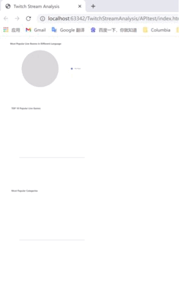

# TwitchStreamAnalysis
# Features (Still in progress)
- Analyze and visualize real time data collected from Twitch API. 
- Update data dynamically(update every 5 minutes due to Cache mechanism 
of Twitch API).

# Architecture

# Demo

# Sample of Results

